# Mascot and app-icon concepts — Maths, Geography, Finance

These are concepts for the owner to pick from (FAMILY-STANDARD §2). They are not final art.
Bee (Bizzy) and India (the peacock) keep their mascots.

| App | Option | Icon | Sheet | Note |
|---|---|---|---|---|
| Maths | **Octo** the octopus *(recommended)* | 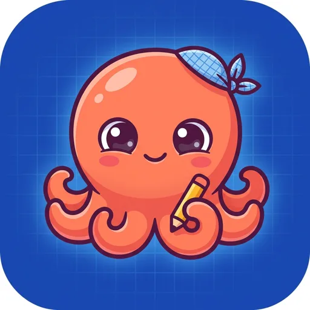 | 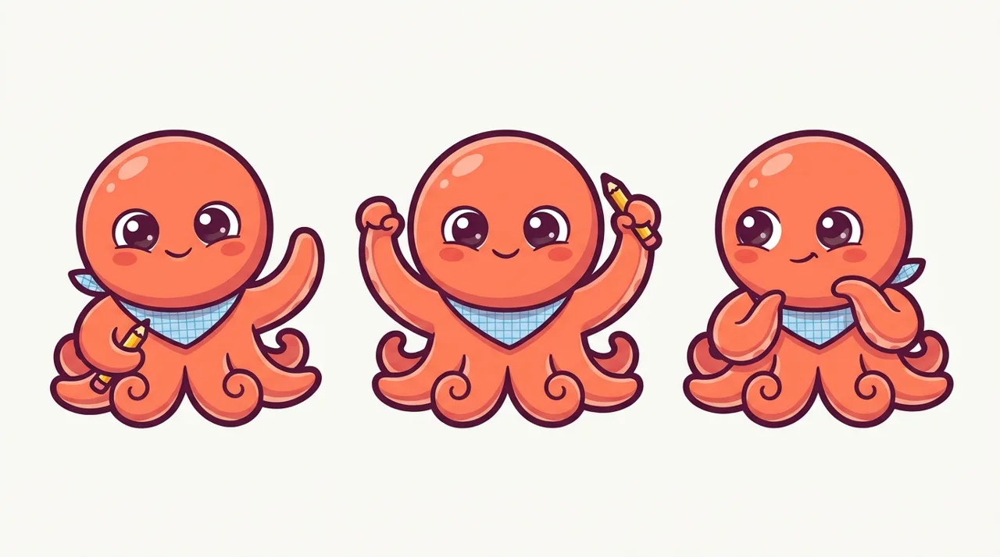 | Eight arms for counting. A silhouette nobody else in the family has, and it reads at 48 px. |
| Maths | Nova the koi | 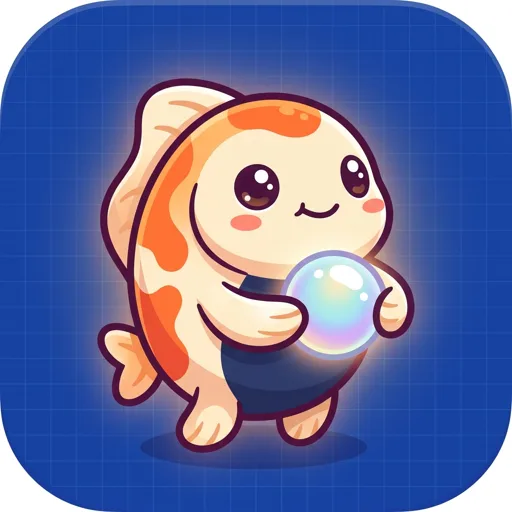 | 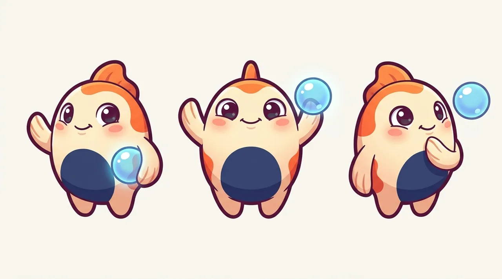 | Continuity with today's onboarding guide. The koi is also in Geography and Finance today. |
| Maths | Tally the hedgehog | 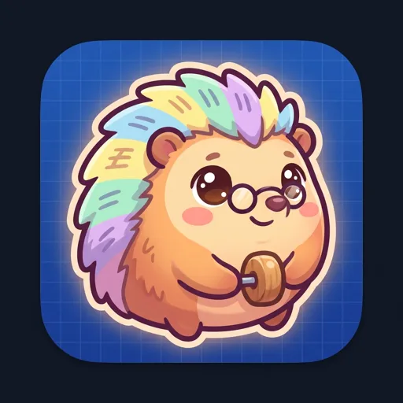 | 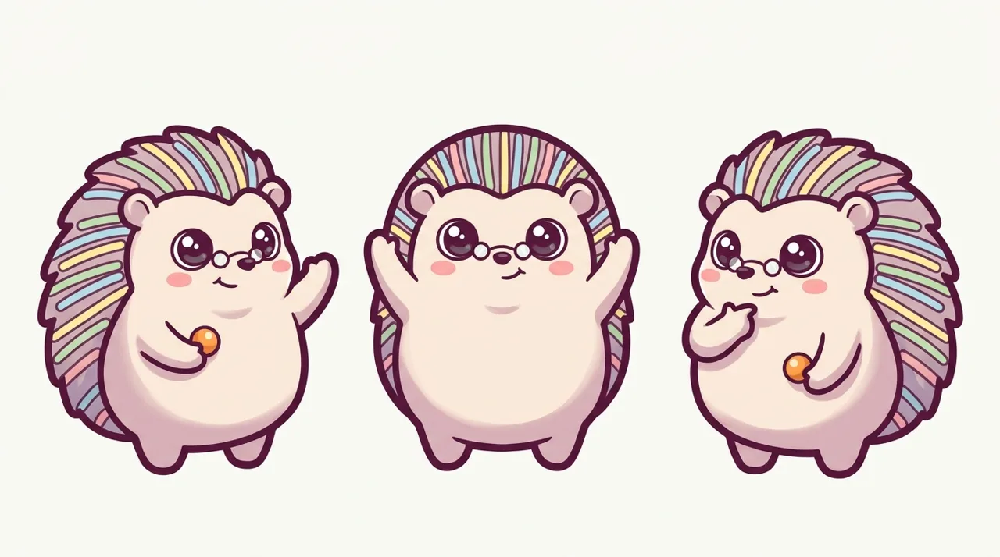 | Spines as tally marks. The icon came back with a dark frame and scribble marks, so it needs a re-roll. |
| Geography | **Shelly** the sea turtle *(recommended)* | 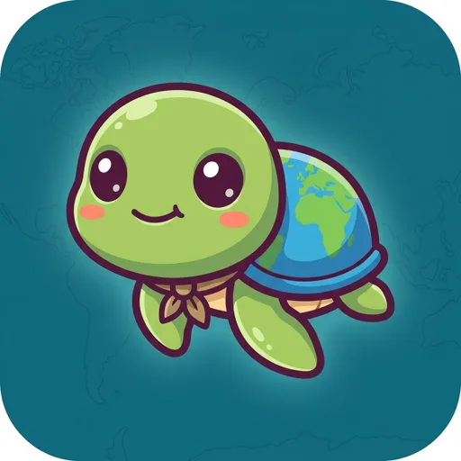 | 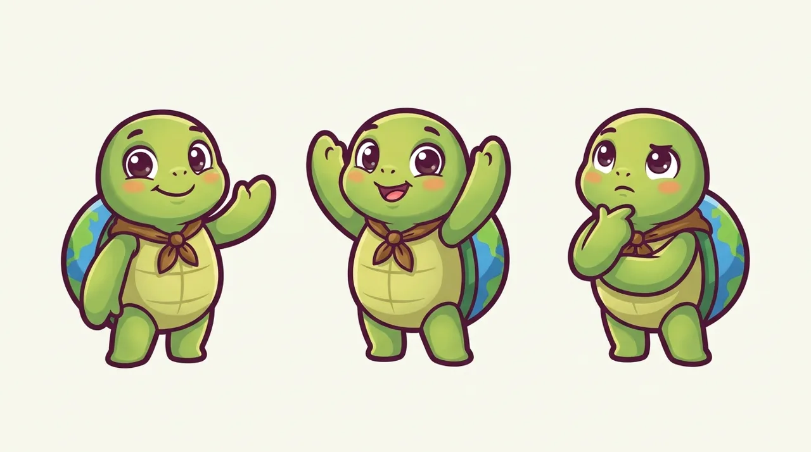 | The shell is a globe, so the subject is in the silhouette. Turtles travel the world, and she ties to the Videos ridley film. |
| Geography | Kip the explorer owl | 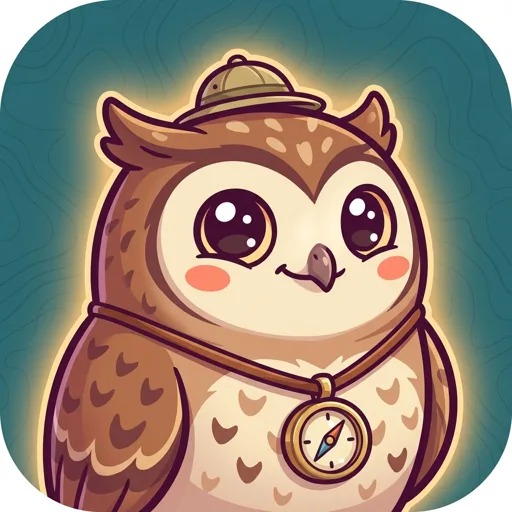 | 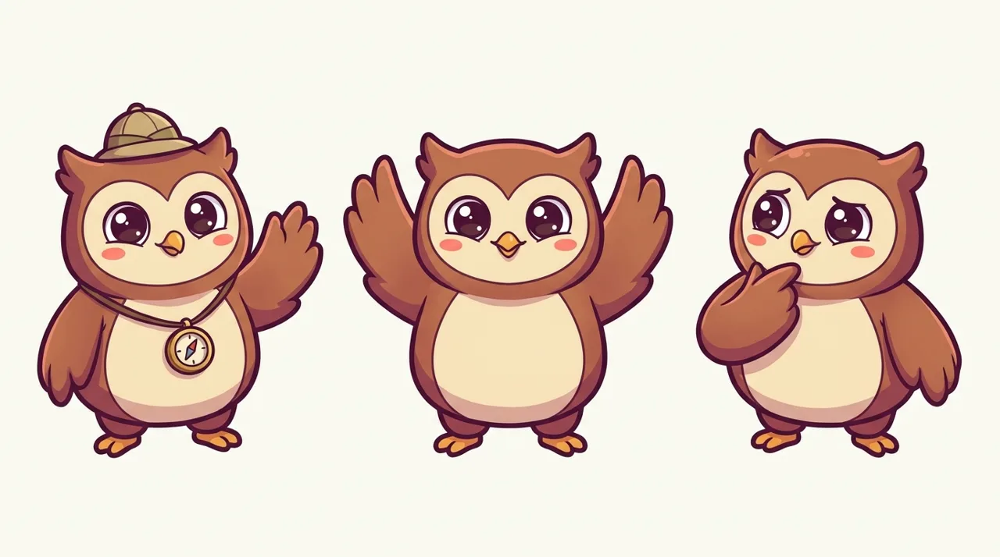 | Grows out of today's Compass Owl, but owls are common mascots. |
| Geography | Roam the fennec fox | 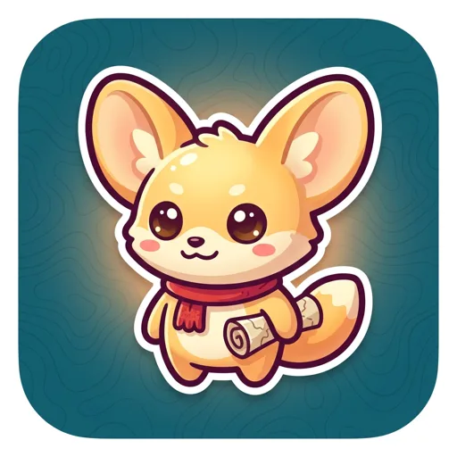 | 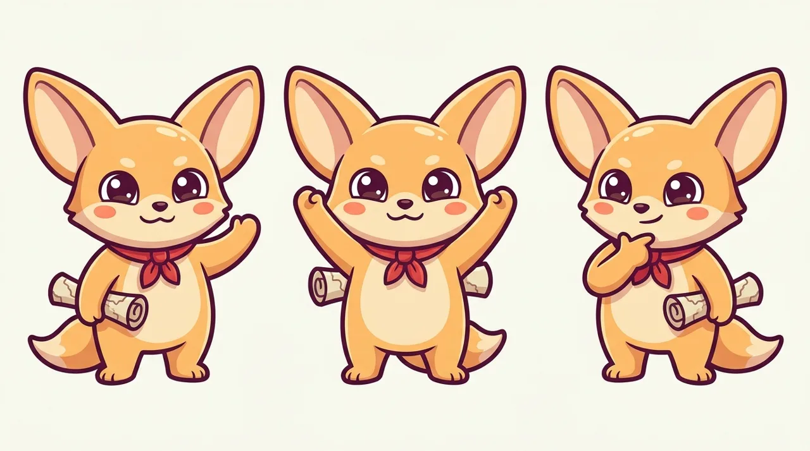 | Warm and cute; the map is a prop rather than part of the character. |
| Finance | **Pip** the squirrel *(recommended)* | 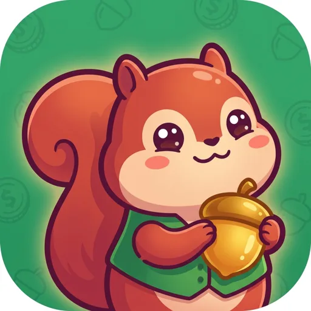 | 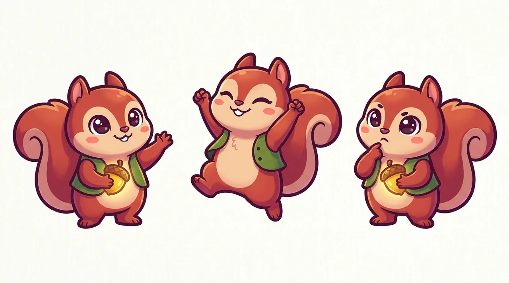 | Already Finance's greeter. The acorn makes saving visible without any currency sign. |
| Finance | Penny the pangolin | 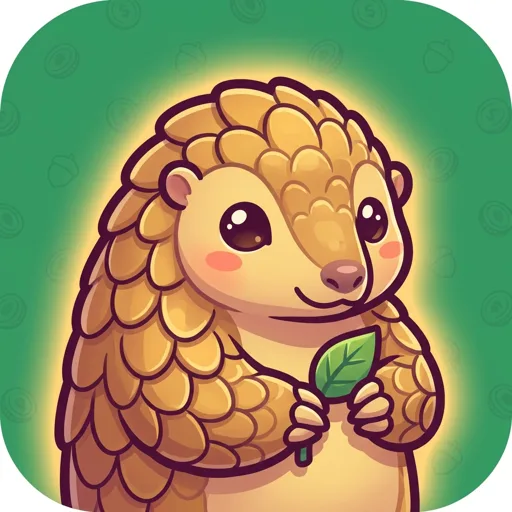 | 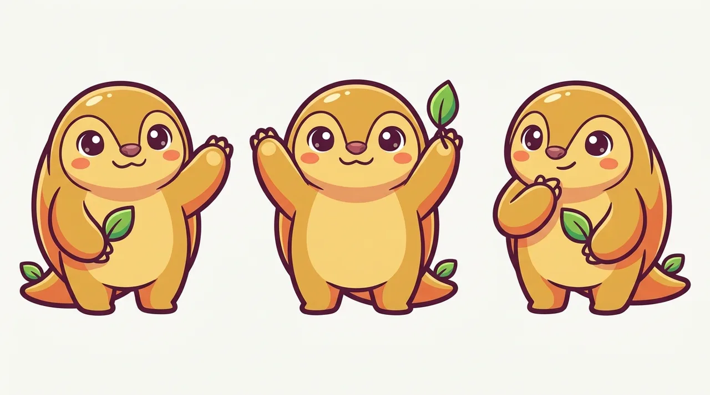 | Coin-gold scales. The sheet lost the scales (inconsistent), so it needs a re-roll if chosen. |
| Finance | Bo the beaver | 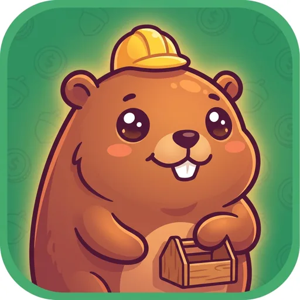 | 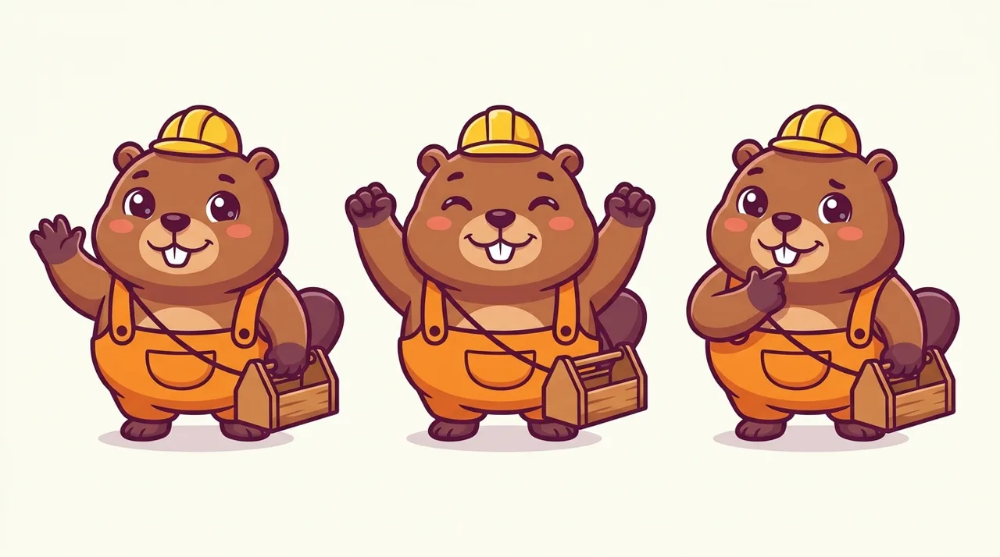 | The builder, for The Works. Bo is already a cast name in the town. |

**Before shipping the chosen mascot:**
- Re-roll the icon background without currency symbols. The Finance tiles show "$" coins in the pattern, and currency is a setting.
- Draw the six poses: wave, cheer, think, point, sleep, oops.
- Look at every sprite.

Painted with a Gemini image model through the family prompt: sticker style, plum outline, no lettering. The prompts are in the Hive session's scratch `mascot/gen.py`.
